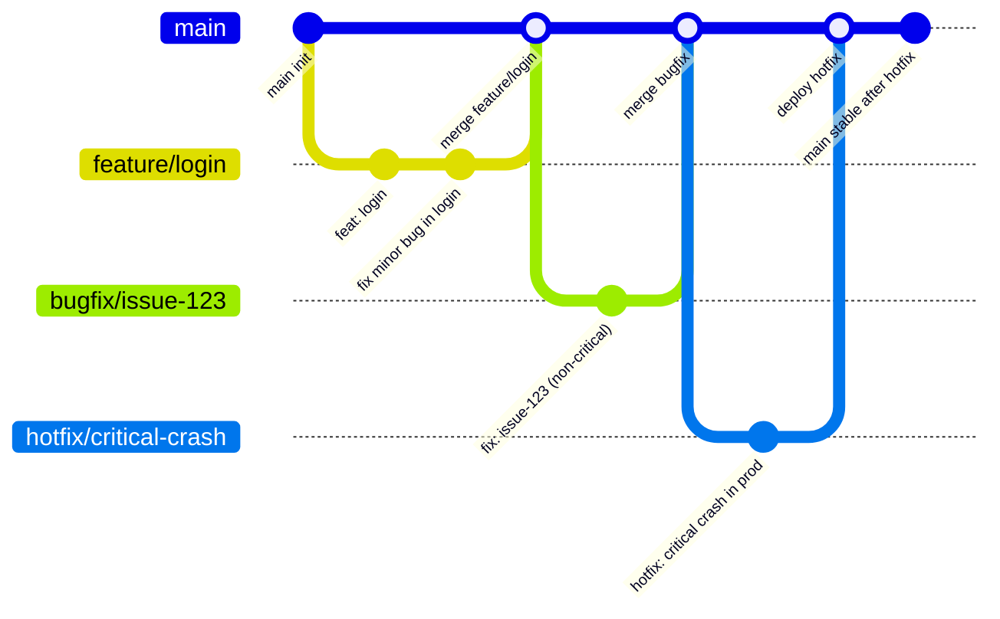
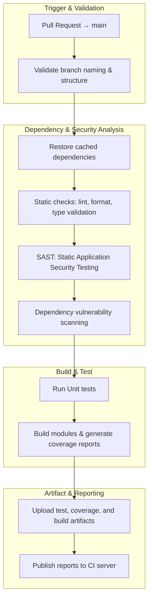

## 🛠 Branch Workflows

This repository follows the **Semi-GitFlow** branching model -> Domain-Dev.

### 🏗 Branch Structure

`main` → Domain Logic-ready code, always stable.

`feature/*` → For developing new features. Branch off from `main`, merge back into `main`.

`bugfix/*` → For fixing reported issues (non-critical, not blocking production). Must originate from a tracked
issue/ticket. Branch off from `main`, merge back into `main`.

`hotfix/*` → For urgent/critical fixes in production. Branch off from `main`.

### 🔄 Workflow Summary

#### ✨ Feature Development

Create a `feature/*` branch from `main`.
Used for new functionality.
Merge back into `main`.
If a bug appears during feature development, it is resolved inside the same `feature/*` (not a separate `bugfix/*`).

#### 🐞 Bug Fixing

Create a `bugfix/*` from `main` to address a known issue (originating from an Issue Tracker).
Merge back into `main` after review.

#### 🔥 Hotfix for Production

For critical issues in production, create a `hotfix/*` from `main`.
After fixing:
Merge into `main` → deploy immediately.

#### 📊 Visual



---

## 📝 Commit Message

#### Conventional Commit

```
<type>: <message>
```

#### Type

- `feat` → add feature
- `fix` → bug fix / hot fix
- `docs` → edit documentation
- `style` → change code format/style (does not affect logic)
- `refactor` → edit code but do not add feature, do not fix bug
- `test` → add/edit test
- `chore` → miscellaneous (update dependency, config)

**E.g.**

```
feat: expose callback api
fix: incorrect payment calculation
docs: update README
style: reactive pipeline insteand of imperative code
refactor: optimize structure classes and funtions
test: issuer forward
chore: bump version 1.2.0
```

---

## 🛡 Branch Protection Rules

#### ⚙️ Workflows

- **Applied** `main`
- **Restrict** `creations` | `deletions` | `force pushes`
- **Required**
    - `signed commit`
    - `pull request`
        - required approvals: 1
        - dismiss stale approvals when new commits are pushed
        - conversation resolution before merging
        - allowed merge: *Squash*
    - `status checks`
        - up to date before merging
        - required: *develop*

#### ✍️ Working

- **Applied** `feature/*` | `bugfix/*` | `hotfix/*`
- **Required** `signed commit`

---

## 🧩 Continuous Integration

1. **Trigger**: `pull_request` → `main`
2. **Steps**:

- **Dependency Caching**: Restore cached dependencies for faster build times.
- **Static & Security Analysis**:
    - **Static checks**: code style, linting, and type validation.
    - **SAST (Static Application Security Testing)**: detect code vulnerabilities.
    - **Dependencies**: vulnerability scanning.
- **Testing & Building**: Run unit tests, build modules, and generate coverage reports.
- **Artifact Upload**: Upload test, coverage, and build artifacts to the CI server.

3. **Visual**


